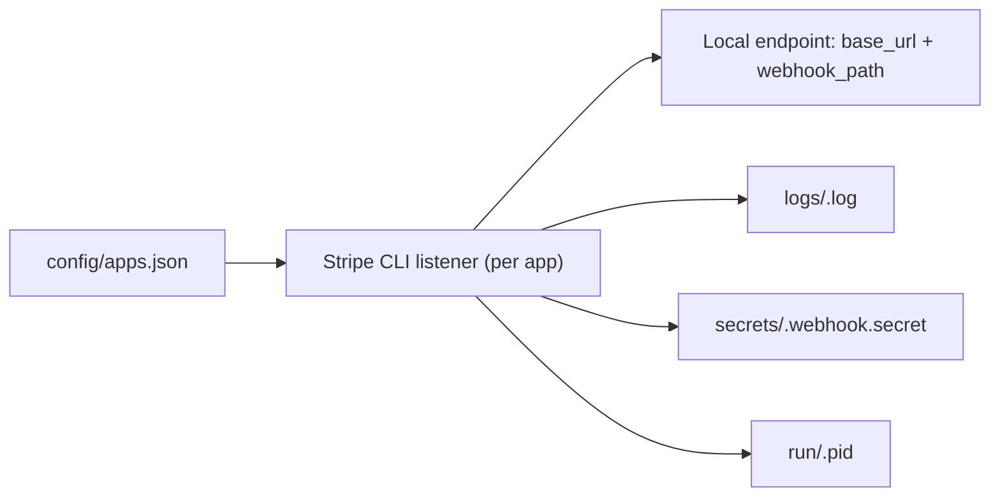

# Stripe Lab (Demo)

[](https://github.com/Cobracco/stripe-lab/actions/workflows/ci.yml)
[](./LICENSE)

Demo repository for a reusable local Stripe CLI lab on Windows Server 2025.
It helps teams test multiple local applications with isolated sandbox keys and webhook listeners.

## Demo Scope

- This project is **for demo/local testing**.
- Use **only** Stripe test keys (`sk_test_*`).
- The scripts block live keys (`sk_live_*`).
- No secrets are committed in this repository.

## Features

- Centralized app registry: `config/apps.json`
- Dedicated listener per app
- Single-app and batch start/stop commands
- Runtime webhook secret extraction to local file
- Per-app logs and PID tracking
- Trigger test events on a selected app
- Status dashboard command for all configured apps

## Architecture



## Repository Layout

Clone to `C:\stripe-lab` on Windows:

- `C:\stripe-lab\bin\`
- `C:\stripe-lab\config\apps.json`
- `C:\stripe-lab\scripts\`
- `C:\stripe-lab\logs\`
- `C:\stripe-lab\secrets\`
- `C:\stripe-lab\run\`

## Quick Start

1. Install Stripe CLI:

```powershell
cd C:\stripe-lab
.\scripts\Install-StripeCli.ps1
```

2. Initialize folders and (optional) ACL lockdown:

```powershell
.\scripts\Initialize-StripeLab.ps1 -RootPath C:\stripe-lab -LockDownAcl
```

3. Configure app registry:

```powershell
Copy-Item .\config\apps.example.json .\config\apps.json -Force
```

4. Set one test key as machine env var:

```powershell
[Environment]::SetEnvironmentVariable("STRIPE_APP_DEMO_APP_1_SK_TEST", "sk_test_xxx", "Machine")
```

5. Start one listener:

```powershell
.\scripts\Start-StripeListener.ps1 -AppName demo-app-1 -RootPath C:\stripe-lab
```

6. Trigger one test event:

```powershell
.\scripts\Test-StripeEvent.ps1 -AppName demo-app-1 -Event checkout.session.completed -RootPath C:\stripe-lab
```

7. Check global status:

```powershell
.\scripts\Get-StripeStatus.ps1 -RootPath C:\stripe-lab
```

## Commands

- Start one app:

```powershell
.\scripts\Start-StripeListener.ps1 -AppName <name> -RootPath C:\stripe-lab
```

- Start all enabled apps:

```powershell
.\scripts\Start-StripeListeners.ps1 -OnlyEnabled -RootPath C:\stripe-lab
```

- Stop one app:

```powershell
.\scripts\Stop-StripeListeners.ps1 -AppName <name> -RootPath C:\stripe-lab
```

- Stop all:

```powershell
.\scripts\Stop-StripeListeners.ps1 -RootPath C:\stripe-lab
```

- Trigger one Stripe event for one app:

```powershell
.\scripts\Test-StripeEvent.ps1 -AppName <name> -Event <stripe_event> -RootPath C:\stripe-lab
```

## App Config Contract

Each app in `config/apps.json` must include:

- `name` (unique)
- `repo`
- `sandbox`
- `base_url`
- `webhook_path`
- `events` (string array)
- `stripe_secret_env` (name of env var containing `sk_test_*`)
- `enabled` (boolean)

A ready-to-edit template is available in `config/apps.example.json`.

## Runtime Files (Not Versioned)

- PID file: `run\<app>.pid`
- Stdout log: `logs\<app>.log`
- Stderr log: `logs\<app>.err.log`
- Webhook secret: `secrets\<app>.webhook.secret`

## Security Notes

- Keep `secrets/` local and private.
- Never paste full API keys into logs/issues.
- Rotate test keys if exposed.
- Do not reuse this setup for production webhook handling.

See [SECURITY.md](./SECURITY.md).

## Troubleshooting

- `Stripe CLI non trovato`: confirm `stripe version` works.
- `Environment variable ... non impostata`: set the env var declared in `stripe_secret_env`.
- `Rifiutata chiave live`: replace `sk_live_*` with `sk_test_*`.
- `Webhook signature verification failed`: update app webhook secret using `secrets\<app>.webhook.secret`.
- `404 endpoint`: verify `base_url` and `webhook_path`, and ensure local app is running.

## Contributing

- Read [CONTRIBUTING.md](./CONTRIBUTING.md)
- Follow [CODE_OF_CONDUCT.md](./CODE_OF_CONDUCT.md)
- Use issue templates for bug reports/features
- See change history in [CHANGELOG.md](./CHANGELOG.md)

## License

MIT License. See [LICENSE](./LICENSE).
